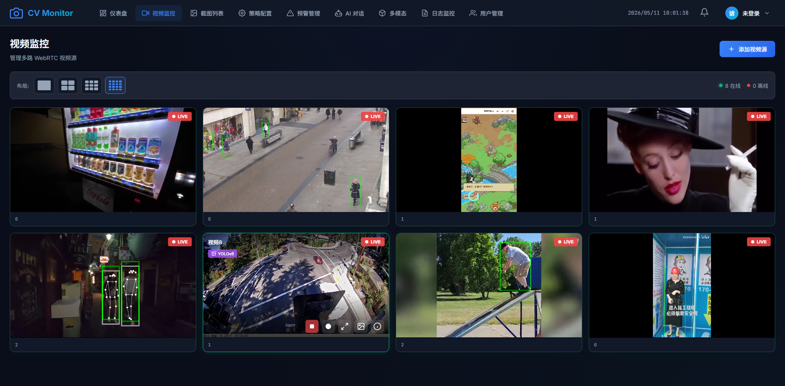
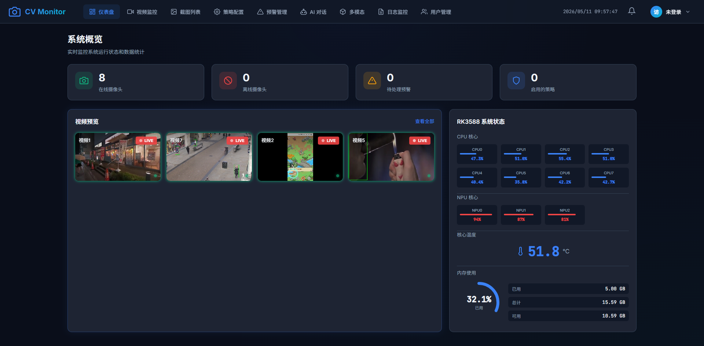
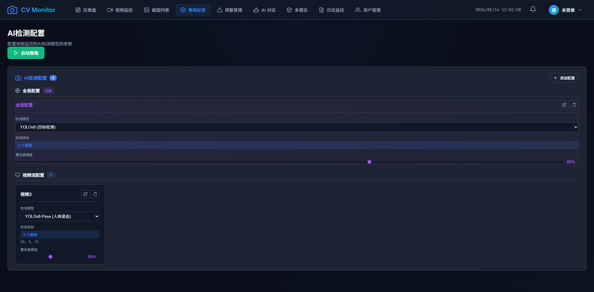
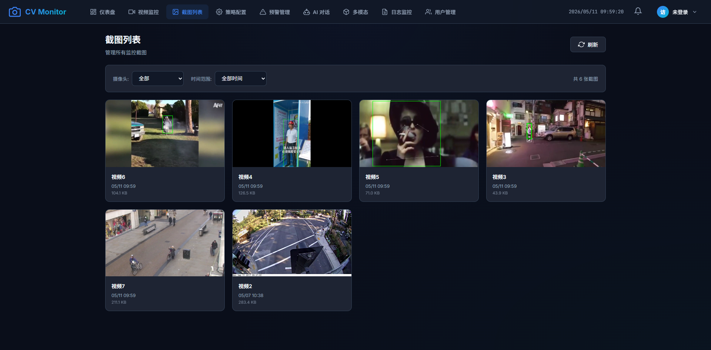
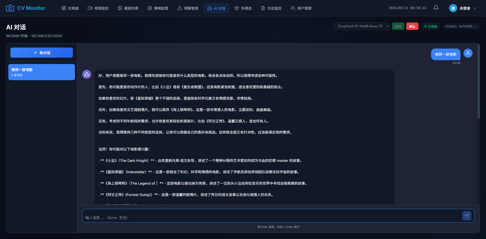
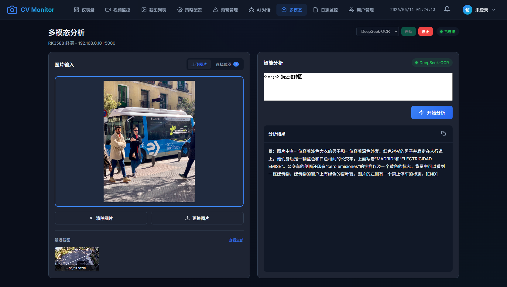
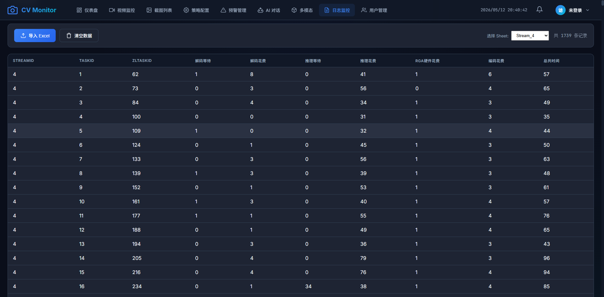

# 边缘 AI 视频分析系统

一个基于RK3588的实时八路视频 AI 分析系统，支持 RTSP 输入、多线程并发推理、目标检测、Pose、Seg、YUV/RGA  渲染以及 WebRTC 实时推流。
系统支持端侧大模型与多模态推理能力，可结合视频分析结果进行视觉理解与智能交互
---

# 项目演示
## rk3588 8路零拷贝实时推理

<p align="center">
  
</p>

## rk3588 资源实时监控

<p align="center">
  
</p>

## 多种模型策略配置

<p align="center">
  
</p>

## 截图预警

<p align="center">
  
</p>

## 端侧大模型流式输出

<p align="center">
  
</p>

## 端侧多模态分析

<p align="center">
  
</p>

## 延迟日志分析

<p align="center">
  
</p>

---

# 项目功能

- 多路 RTSP 视频输入
- 多线程推理 Pipeline
- 目标检测 / Pose / Segmentation
- 动态模型热切换
- 模型策略调度
- 线程独立模型实例
- RKNN推理后端
- YUV 绘制
- RGA 硬件加速绘制
- WebRTC 实时推流
- 视频流生命周期管理
- 边缘 AI 部署优化
- 端侧大模型对话流式输出
- 端侧多模态分析
---

# 系统架构

```text
                +----------------+
                |   RTSP 输入    |
                +----------------+
                         |
                         v
                +----------------+
                |   MPP 解码     |
                +----------------+
                         |
                         v
                +----------------+
                |   任务队列     |
                +----------------+
                         |
                         v
                +----------------------+
                |   Worker 线程池      |
                +----------------------+
                    |       |       |
                    v       v       v
              +---------+---------+---------+
              | 模型 A  | 模型 B  | 模型 C  |
              +---------+---------+---------+
                         |
                         v
                +----------------+
                | 后处理模块     |
                +----------------+
                         |
                         v
                +----------------+
                | YUV/RGA 渲染 |
                +----------------+
                         |
                         v
                +----------------+
                | WebRTC 推流    |
                +----------------+